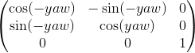
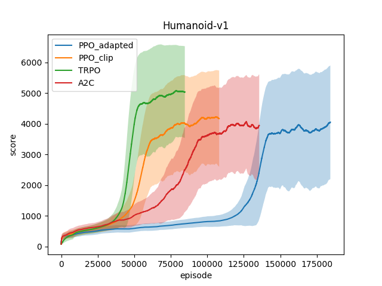
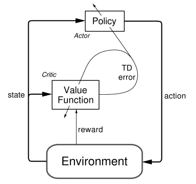

# CAPSTONE PROPOSAL: Arise and walk

---
- author:
   - Guitard Alan
- bibliography:
   - 'proposal/proposal.bib'

Domain Background
=================

#### 

For a human, the ability to walk is one of the most basic knowledge he
learnt during his childhood. Since we are trying with AI to, when we
can’t do better, mimic the ability of human being, the idea of teaching
a robot to walk comes naturally in our mind.

#### 

One of the first attempt to do that was to develop an algorithm by
trying to understand the physics formula of that movement. In 1993,
Yamaguchi et al. tried to make a little robot by trunk motion using the
ZMP (Zero Moment Point) and the three axis (pitch, yaw and roll). In
1999, Nagasaka et al. added the OGM (Optimal Gradient Method) to that
approach to “optimizes the horizontal motion of a trunk to reduce the
deviation of the calculated ZMP from its reference.” and
design the KHR-2 robot. The result was good but the gait of the robot
was not very natural because it is very difficult to take all the
factors in account for making the robot walking with a human gait.

#### 

Nowadays, Boston Dynamics made a huge advances in humanoïd robotic by
designing Atlas, who was able to do a perfect
backflip, or walk on a non-flat ground. In terms of simulation,
Geijtenbeek et al. desgined a muscle based avatar with two legs
which can take a lot of shape. According to that shape and environment
(e.g. the gravity), they were able to teach the creature to stand and
walk, and it learned the proper gait (one creature with small legs
figured out itself it is easier to jump). All
that studies could be used in many areas. Healthcare institute could
design better articial arm or leg, or could give more efficient
companion robots to their patient. That last one could be use in all
fields of life, like a buttler. In a more ludic ways, we will be able to
design a more realistic gait for our 3D avatar, even for non-player
characters.

Problem Statement
=================

#### 

The problem I want to solve is then to teach a 3D avatar to walk. That
kind of problem is solved with reinforcement learning. For a human,
walking is a simple task but we did learn after many trials, step by
step, with the help of our hand at the beggining and then stand and
walk.

#### 

To teach that to a 3D avatar, we need to define algorithm which allow
not only the avatar to walk but to walk with a human gait to avoid too
much movement for a single step, or avoid doing a false movement and
fail down after three steps because of that false movement. At each
step, without thinking about it, humans take care of the two/three steps
we will do in the future. We have to design our model to be able to do
that and optimally with the same gait as human, that we can consider as
the optimal gait for our shape.

Datasets and Inputs
===================

#### 

I will use OpenAI with the Gym python library, load the
Roboschool environment (because the default Mujoco is not free) and use
deep reinforcement learning to make the robot stands and walks.

Action space
------------

#### 

The action space is a vector of 17 float values in the range \[-1, 1\].
Each value corresponds to the joints of the avatar by this order from
[XML](https://github.com/openai/roboschool/blob/master/roboschool/mujoco_assets/humanoid_symmetric.xml):

-   abdomen\_y

-   abdomen\_z

-   abdomen\_x

-   right\_hip\_x

-   right\_hip\_z

-   right\_hip\_y

-   right\_knee

-   left\_hip\_x

-   left\_hip\_z

-   left\_hip\_y

-   left\_knee

-   right\_shoulder1

-   right\_shoulder2

-   right\_elbow

-   left\_shoulder1

-   left\_shoulder2

-   left\_elbow

At each step, these values are applied to all the joints of the body by
the code

    for n,j in enumerate(self.ordered_joints):
        j.set_motor_torque( self.power*j.power_coef \
                             *float(np.clip(a[n], -1, +1)) )

in the `apply_action` function in the class which extends the `gym.Env`
class (`RoboschoolMujocoXmlEnv`) to set the torque value into the
respective motor.

Observation space
-----------------

#### 

The state space (or observation space) is a vector of 44 float values in
the range \[-5, 5\] (Roboschool clip the vector with numpy before
returning it in the `step` function). That vector is a concatenation of
three subvectors:

-   **more**: It is a vector of 8 values defined as follows:

    -   The distance between the last position of the body and the
        current one.

    -   The sinus of the angle to the target.

    -   The cosinus of the angle to the target.

    -   The three next values is the X, Y and Z values of the matrix
        multiplication between

        -   

        -   The speed vector of the body.

    -   The roll value of the body

    -   The pitch value of the body

-   **j**: This is the current relative position of the joint
    described earlier and their current speed. The position is in the
    even position, and the speed in the odds (34 values).

-   **feet\_contact**: Boolean values, 0 or 1, for left and right
    feet, indicating if the respective feet is touching the ground
    or not.

Reward
------

#### 

The reward is a sum of 5 computed values:

-   **alive**: -1 or +1 wether is on the ground or not

-   **progress**: potential minus the old potential. The potential
    is defined by the speed multiplied by the distance to target point,
    to the negative.

-   **electricity\_cost**: The amount of energy needed for the
    last action

-   **joints\_at\_limit\_cost**: The amount of collision between
    joints of body during the last action

-   **feet\_collsion\_cost**: The amount of feet collision taken
    during the last action

NIPS2018: AI for prosthetics
----------------------------

#### 

Roboschool seems to be a good choice and I have a good understanding of
the environment because the state space and the action space is not well
documented and I had to dig into on my own to get it. I may do some
mistakes in my knowledge and if I have problem problems with the
environment, I will use the NIPS2018. It has
the benefits of being documented on its spaces and having a similar
interface than gym environment. The only change is the model not having
a torso, so a model performing well on Roboschool will probably not work
well on NIPS.

Solution Statement
==================

#### 

In my research, I figured out two candidar for the chosen algorithm: A2C
(Advantage Actor Critic) and Deep Q-Learning. For the sake of my
learning, I am really interested in the A2C algorithm since it is the
one who made great progress in Reinforcment Learning (I am thinking
about AlphaGO). And above all, I understand that
this algorithm will suit more on that problem since the walk of the
robot is a continuous learning, and not an episodic, for which Deep
Q-Learning is more suitable.

Benchmark Model
===============

#### 

The random action model makes the avatar lying down on the ground
convulsing because it doesn’t know how to stand up and it is just moving
its joints randomly.

In the above benchmark, we can see that Advantage Actor Critc algorithm
is able to converge rewards at around 100000 episodes. That tells me
that I have to be patient on my training and have good metrics to tell
if my model will converge or not.

Evaluation Metrics
==================

#### 

I will need two metrics because I have two kind of session for the body:
it can walk and fail to stand or it can walk without falling. When the
avatar will fall, I will restart the session, because to teach it to
stand up is another kind of problem.

#### 

At the beggining of the training, the body will fall and fall again very
quickly. So my metric during that period will be the amount of restart
per second. When the body will start to have less fall, that metric will
not be informative anymore. I have to find metrics to evaluate the gait
of the walk. For that, I will plot the angle of the current body
position from the start position in respect to the axe the avatar will
try to follow. I will also plot the distance of the gravity center from
the floor, the mean speed and the reward per action, in order to compare
with the above benchmark.

Project Design
==============

#### 

In order to solve that problem, I will first design the architcture of
my program on paper. The thing is to have a global comprehension of the
flow of the program. Then I will desgin my model with Keras and
Tensorflow, Keras for the simplicity and Tensorflow to have my first
insight with it. Indeed, I think the simplicity of Keras will prevent me
to implement properly the model below.

For my models, I will use fully-connected layers with not more five 5
hidden layers. The powerness of the actor-critc algorithm lies in the
team works between them and not in their complexity.

#### 

I will design my network for the policy with experience replay, in order
to feed the actor with a random set of its memory
`<state, action, reward, state+1, Q>` weighted by the Q-value outputed
by the critic network (in order to learn more on good actions and less
on bad action). The policy will be epsilon-greedy, that means it will
have an epsilon chance to take a random action. That value will
decrease over time to have good exploration-exploitation policy.
